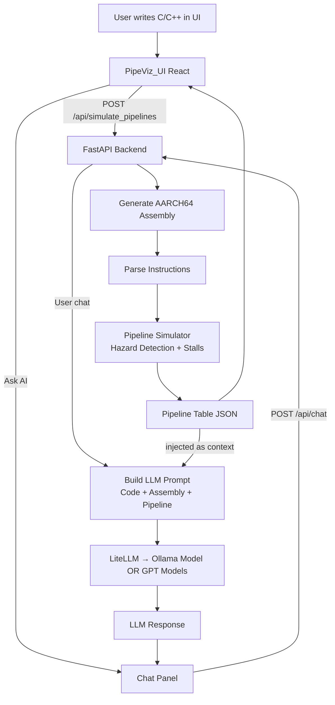

# PipeViz-simulator
-------------------
This project is done for Course `SP26-CSE-60321-01 Advanced Computer Architecture` and its a group project and contributors are
* Laxminarayana Vadnala <lvadnala@nd.edu>
* Patrick Do <mdo23@nd.edu>
* Jude Lynch <jlynch23@nd.edu>

PipeViz: A Cycle-Accurate Pipeline Simulator and Visualizer for ARM/x86 Assembly is a system designed to help users understand instruction-level execution by visualizing the cycle-by-cycle behavior of a CPU pipeline for a given program. The workflow begins with a program written in supported languages such as C/C++, Rust, or Python, which is compiled inside Docker containers to generate corresponding ARM or x86 assembly code. This assembly is then processed by a FastAPI-based backend that parses instructions and constructs a structured JSON representation of pipeline stages across cycles. The backend also incorporates an AI-assisted module to detect structural and data hazards, enabling smarter identification of stalls and dependencies. The generated JSON is consumed by a ReactJS frontend, which provides an interactive visualization of the pipeline, highlighting hazards, stalls, and execution flow. Key features include hazard visualization, stall detection, toggling between forwarding and non-forwarding modes, branch prediction strategies (static and dynamic), and a potential extension to superscalar pipeline simulation. To ensure correctness and robustness, each stage of the system—assembly generation, backend processing, and frontend rendering—is validated with dedicated test cases, with Docker-based execution used to verify that input programs are correctly compiled and runnable before simulation.

## [NOTE]: This project only Works on ARM based mac only and requires the docker installation.

## [NOTE]: This project only accepts single file uploads, doesnt work on the directory or zip files.

### Flow diagram of the PipeViz project


---

## Prerequisites

Make sure the following are installed before getting started:

- [Docker Desktop](https://www.docker.com/products/docker-desktop/) — required for compiling code to assembly
- [uv](https://docs.astral.sh/uv/) — Python package manager for the backend
- [Bun](https://bun.sh/) — JavaScript runtime and package manager for the frontend
- [just](https://github.com/casey/just) *(optional)* — shortcut runner

Install `uv`:
```bash
curl -LsSf https://astral.sh/uv/install.sh | sh
```

Install `bun`:
```bash
curl -fsSL https://bun.sh/install | bash
```

---

## Environment Variables

The backend uses the OpenAI API for extracting processor configurations from text or images. You must set your key before running:

```bash
export OPENAI_API_KEY="sk-..."
```

To avoid setting this every session, add it to your shell profile (`~/.zshrc`):
```bash
echo 'export OPENAI_API_KEY="sk-..."' >> ~/.zshrc
source ~/.zshrc
```

---

## Option A — Local Dev (recommended for development)

Runs the backend and frontend directly on your machine with hot-reload.

### 1. Backend

```bash
cd pipeviz
uv sync                          # creates .venv and installs all dependencies
source .venv/bin/activate
uv run main.py --port 5001
```
if you know how to setup the virtual env using the `pyproject.toml` and use the normal python execution after activating the virtual environment and main entry point to the backend server is `main.py` file. if you want to pass the model type like you want to use the cloud provider model like `gpt-5.4` then pass this `--model-type cloud` or if you are choosing the local ollama model using the docker compose stack described below pass `--model-type local` which make sures to proper context. and also note that if you are using the cloud based provider please make sure to create the `.env` file in the `pipeviz` folder and make sure have `OPENAI_API_KEY=....` key in there or set it globally as mentioned above in `.zshrc` file.

Backend runs at: `http://localhost:5001`
API docs (auto-generated) feature of FastAPI: `http://localhost:5001/docs` 

### 2. Frontend

Open a new terminal:

```bash
cd pipeviz-ui
bun install
bun run dev
```

Frontend runs at: `http://localhost:5173`

---

## Option B — Docker Compose (LLM Stack) if you want to the local LLM model and dont want to model to use the any vendor setups like chatgpt or claude.

Runs everything inside Docker containers. Only Docker is required — no Python or Bun needed locally.

```bash
docker compose up --build
```

- LiteLLM docs: `http://localhost:4000`

---

## Project Structure

```
PipeViz-simulator/
├── docker-compose.yaml     # Runs both services together
├── justfile                # Shortcuts: just run-backend, just run-frontend
├── pipeviz/                # FastAPI backend (Python)
│   ├── main.py
│   ├── assembly_assets/    # Language-specific Dockerfiles + opcode config
│   ├── mock/               # Fibonacci test programs (C, C++, Rust)
│   └── src/
│       ├── models/         # Pydantic schemas (pipeline + processor config)
│       ├── services/       # LLM extractor (OpenAI)
│       ├── pipeline/       # Simulator + workflow orchestration
│       └── routers/        # API endpoints
└── pipeviz-ui/             # React + Vite frontend (Bun)
    └── src/
        ├── components/     # CodeEditor, PipelineGrid, FileUpload, util
        └── App.jsx
```
