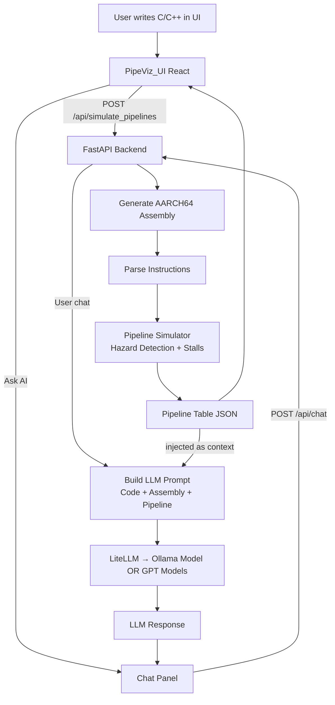

# PipeViz-simulator
-------------------
This project is done for Course `SP26-CSE-60321-01 Advanced Computer Architecture` and its a group project and contributors are
* Laxminarayana Vadnala <lvadnala@nd.edu>
* Patrick Do <mdo23@nd.edu>
* Jude Lynch <jlynch23@nd.edu>

PipeViz: A Cycle-Accurate Pipeline Simulator and Visualizer for ARM/x86 Assembly is a system designed to help users understand instruction-level execution by visualizing the cycle-by-cycle behavior of a CPU pipeline for a given program. The workflow begins with a program written in supported languages such as C/C++, Rust, or Python, which is compiled inside Docker containers to generate corresponding ARM or x86 assembly code. This assembly is then processed by a FastAPI-based backend that parses instructions and constructs a structured JSON representation of pipeline stages across cycles. The backend also incorporates an AI-assisted module to detect structural and data hazards, enabling smarter identification of stalls and dependencies. The generated JSON is consumed by a ReactJS frontend, which provides an interactive visualization of the pipeline, highlighting hazards, stalls, and execution flow.

Key capabilities:
- Cycle-by-cycle pipeline visualization
- Data hazards: RAW, WAR, WAW
- Structural hazard detection
- Multiple pipeline types (static in-order, scoreboard, dynamic in-order, in-order superscalar, VLIW, Tomasulo, out-of-order)
- LLM-assisted optimization chat with stored workflow history

## [NOTE]: This project currently targets ARM-based macOS and requires Docker.
## [NOTE]: Only single-file inputs are supported (no folders or zip archives).

### Flow diagram of the PipeViz project


Prerequisites

Make sure the following are installed before getting started:

- [Docker Desktop](https://www.docker.com/products/docker-desktop/) — required for compiling code to assembly
- [uv](https://docs.astral.sh/uv/) — Python package manager for the backend
- [Bun](https://bun.sh/) — JavaScript runtime and package manager for the frontend
- [just](https://github.com/casey/just) *(optional)* — shortcut runner

Install `uv`:
```bash
curl -LsSf https://astral.sh/uv/install.sh | sh
```

Install `bun`:
```bash
curl -fsSL https://bun.sh/install | bash
```

---

## Environment Variables

Cloud LLM usage (optional):

```bash
export OPENAI_API_KEY="sk-..."
```

To avoid setting this every session, add it to your shell profile (`~/.zshrc`):
```bash
echo 'export OPENAI_API_KEY="sk-..."' >> ~/.zshrc
source ~/.zshrc
```

---

## Option A — Local Dev (recommended for development)

Runs the backend and frontend directly on your machine with hot-reload.

### 1. Backend
```bash
cd pipeviz
uv sync                          # creates .venv and installs all dependencies
source .venv/bin/activate
uv run main.py --port 5001
```

Model selection:
- `--model-type local` → uses LiteLLM + Ollama (see Option C)
- `--model-type cloud` → uses OpenAI (requires `OPENAI_API_KEY`)

Backend runs at: `http://localhost:5001`  
API docs: `http://localhost:5001/docs`

### 2. Frontend
```bash
cd pipeviz-ui
bun install
bun run dev
```

Frontend runs at: `http://localhost:5173`

---

## Option B — Docker Compose (LLM Stack)

Starts local LLM services (Ollama + LiteLLM).  
Use this if you want `--model-type local`.

```bash
docker compose up --build
```

- Ollama: `http://localhost:11434`
- LiteLLM: `http://localhost:4000`

---

## Project Structure

```
PipeViz-simulator/
├── Dockerfile               # Single-container dev (backend + frontend)
├── docker-compose.yaml      # LLM stack (Ollama + LiteLLM)
├── llm_models/              # LiteLLM config + Ollama model volume
├── justfile                 # Shortcuts: just run-backend, just run-frontend
|-- report_latex_files/      # contains the latex files used to generate the report
|-- CArch_report.pdf         # Report fiel contains the details about project
├── pipeviz/                 # FastAPI backend (Python)
│   ├── main.py
│   ├── assembly_assets/     # Language-specific Dockerfiles + opcode config
│   ├── mock/                # Example programs (C, C++, Rust)
│   └── src/
│       ├── models/          # Pydantic schemas
│       ├── services/        # LLM extractor + tools
│       ├── pipeline/        # Simulator + workflow orchestration
│       └── routers/         # API endpoints
└── pipeviz-ui/              # React + Vite frontend (Bun)
    └── src/
        ├── components/      # CodeEditor, PipelineGrid, ChatPanel, util
        └── App.jsx

### Note: All the cases study runs written in the report is saved in folder `pipeviz/case_studies` folder and it shows all the context we captured and LLM responses and prompt templates and more its all self explainatory.
